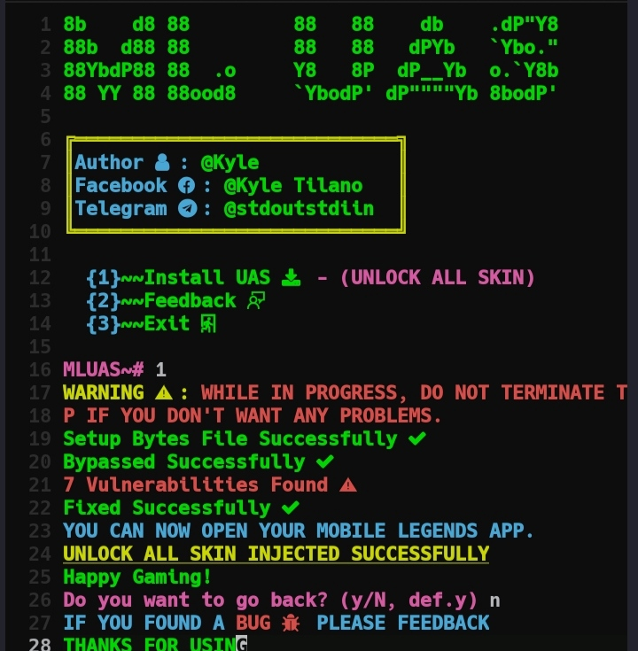
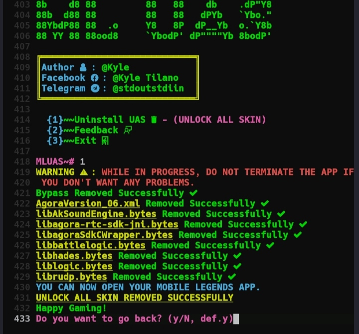
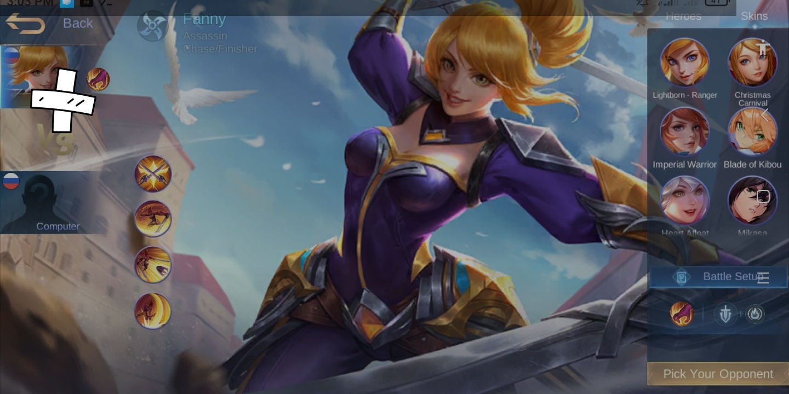

# **MLUAS**
**UNLOCK MLBB ALL SKIN**
> [!NOTE]
> ONLY WORKS ON TERMUX
# **Installation**
```bash
cd $HOME
pkg update
pkg install git node -y
git clone https://github.com/Kairu-bit/MLUnlockAllSkin
cd MLUnlockAllSkin
node main.mjs
```
# **Screenshot**



